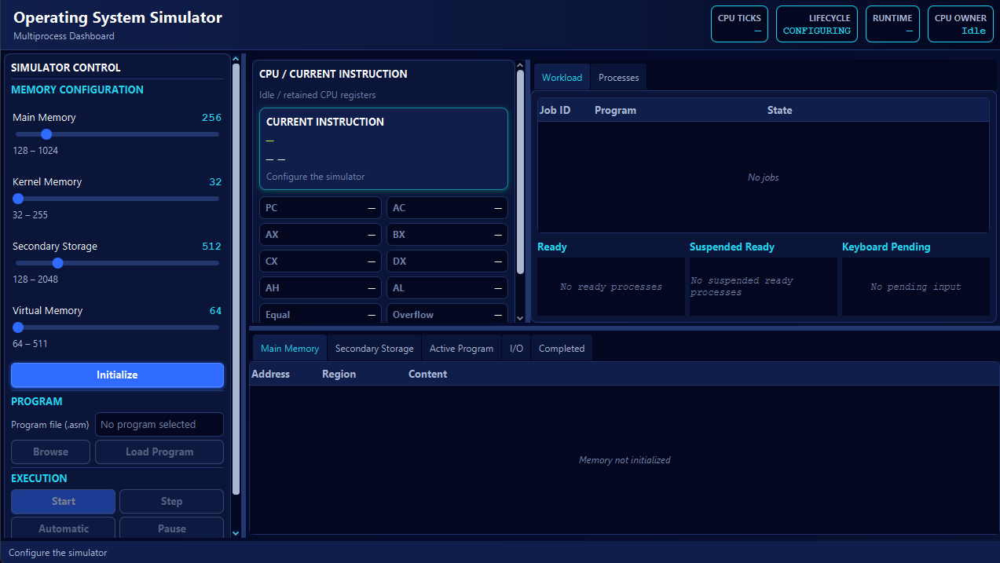
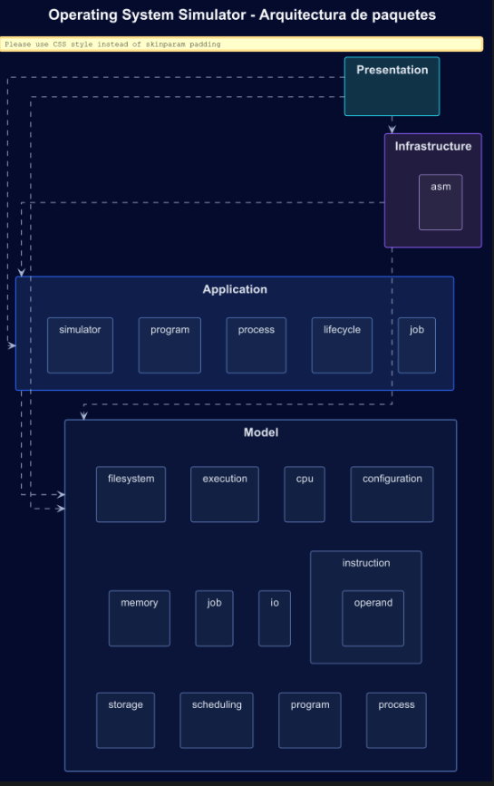

<div align="center">

# 🖥️ Operating System Simulator

### Simulador educativo multiproceso de conceptos fundamentales de Sistemas Operativos

Aplicación de escritorio desarrollada en **Java + JavaFX** para representar de forma visual
la administración de procesos, CPU, memoria, almacenamiento, interrupciones, I/O,
filesystem, scheduling y context switching de una minicomputadora simulada.

<br>


<br>

</div>

---

<div align="center">



</div>

---

## 📋 Contenido

- [🎓 Información académica](#-información-académica)
- [🚀 Descripción del proyecto](#-descripción-del-proyecto)
- [✨ Características principales](#-características-principales)
- [🧠 Modelo del sistema operativo](#-modelo-del-sistema-operativo)
- [⚙️ Instruction Set](#️-instruction-set)
- [🏗️ Arquitectura](#️-arquitectura)
- [🛠️ Tecnologías](#️-tecnologías)
- [📦 Requisitos](#-requisitos)
- [💻 Instalación y ejecución](#-instalación-y-ejecución)
- [🖥️ Uso general](#️-uso-general)
- [🧪 Testing y validación](#-testing-y-validación)
- [🌿 GitFlow y DevOps](#-gitflow-y-devops)
- [📐 Diagramas UML](#-diagramas-uml)
- [✅ Objetivos alcanzados](#-objetivos-alcanzados)
- [ℹ️ Decisiones y consideraciones](#️-decisiones-y-consideraciones)
- [🎥 Video demostrativo](#-video-demostrativo)

---

# 🎓 Información académica

| Información | Detalle |
|---|---|
| **Curso** | Principios de Sistemas Operativos |
| **Asignación** | Proyecto #1 — Gestor de Multiprocesos |
| **Estudiante** | Raúl Alfaro Rodríguez |
| **Carnet** | 2023060456 |
| **Estado** | ✅ Desarrollo completado |
| **Video demostrativo** | https://youtu.be/doSFTdcYQJQ |

> [!NOTE]
> Este proyecto corresponde a una **simulación académica** de mecanismos de un Sistema Operativo.
> No implementa un Kernel real ni interactúa directamente con hardware físico.

---

# 🚀 Descripción del proyecto

**Operating System Simulator** recrea una minicomputadora capaz de cargar y ejecutar
múltiples programas escritos en un mini lenguaje ensamblador `.asm`.

Cada programa pasa por un flujo similar al utilizado por un Sistema Operativo:

```text
Archivo .asm
    ↓
ASM Parser
    ↓
Program Image
    ↓
Secondary Storage
    ↓
Job List
    ↓
Admission
    ↓
Process + PCB
    ↓
Ready Queue
    ↓
FCFS Scheduler
    ↓
Dispatcher
    ↓
CPU
    ↓
Execution Engine
```

Durante la ejecución, la aplicación permite observar en tiempo real:

- procesos y sus estados;
- CPU y registers;
- Current Instruction;
- PCB/BCP;
- Ready Queue;
- Jobs;
- Main Memory;
- Secondary Storage;
- Virtual Memory;
- simulated keyboard;
- simulated screen;
- filesystem;
- statistics;
- procesos completados.

---

# ✨ Características principales

### 🧩 Multiprocess Runtime

- Un único CPU simulado.
- Hasta **5 procesos admitidos simultáneamente**.
- Job List.
- Process Table.
- Ready Queue FIFO.
- Scheduler **FCFS non-preemptive**.
- Dispatcher.
- Context switching.
- Save/restore de `CpuContext`.
- Estados suspendidos y bloqueados.

### 🧠 PCB / BCP

Cada proceso mantiene información como:

```text
PID
Process State
PC / IR / AC
AX / BX / CX / DX
AH / AL
Condition Flags
Stack
Open Files
Priority
Base / Limit
Accounting
Kernel PCB Address
Next PCB Address
```

Los PCB se representan dentro de **Kernel Memory** y mantienen enlaces entre procesos.

### 💾 Main Memory

La memoria principal se divide conceptualmente en:

```text
┌────────────────────────────┐
│       KERNEL MEMORY        │
├────────────────────────────┤
│        USER MEMORY         │
└────────────────────────────┘
```

Características:

- tamaño configurable;
- default de `256` posiciones;
- Kernel default de `32`;
- allocation mediante **First-Fit**;
- fragmentation;
- adjacent coalescing;
- protección Kernel/User;
- canonical `MemoryAllocation` handles;
- liberación y reutilización de memoria.

### 💿 Secondary Storage

El almacenamiento secundario se divide en:

```text
┌────────────────────────────┐
│         FILE_INDEX         │
├────────────────────────────┤
│        PROGRAM_DATA        │
├────────────────────────────┤
│       VIRTUAL_MEMORY       │
└────────────────────────────┘
```

Defaults:

```text
Secondary Storage : 512
Virtual Memory    : 64
```

### 🔄 Virtual Memory

La Virtual Memory utiliza un modelo educativo de:

```text
Whole-Process Swapping
```

Operaciones principales:

```text
swapOut()
swapIn()
```

Estados relacionados:

```text
READY
    ↓
READY_SUSPENDED

BLOCKED
    ↓
BLOCKED_SUSPENDED
```

El PCB permanece en Kernel Memory mientras la imagen USER del proceso puede
almacenarse en la región `VIRTUAL_MEMORY` de Secondary Storage.

### ⌨️ Simulated Keyboard

`INT 09H`:

- acepta valores numéricos `0..255`;
- utiliza FIFO;
- soporta prequeued input;
- bloquea el proceso si no hay entrada disponible;
- almacena el resultado en `DX`;
- permite que otro proceso utilice el CPU mientras se espera I/O.

### 🖥️ Simulated Screen

`INT 10H` imprime el valor numérico contenido en `DX`.

La salida puede observarse desde:

```text
I/O → Simulated Screen
```

### 📁 Simulated Filesystem

`INT 21H` implementa:

| Service | Operación |
|---|---|
| `3CH` | Create |
| `3DH` | Open |
| `4DH` | Read |
| `40H` | Write |
| `41H` | Delete |

Los archivos viven dentro del **Secondary Storage simulado**.

> [!IMPORTANT]
> Las system calls simuladas no escriben archivos reales en el filesystem del equipo anfitrión.

---

# 🧠 Modelo del sistema operativo

## Process States

```text
NEW
READY
RUNNING
BLOCKED
READY_SUSPENDED
BLOCKED_SUSPENDED
TERMINATED
```

## Scheduling

```text
FCFS
First Come, First Served
Non-Preemptive
```

La prioridad se conserva como metadata dentro del PCB, pero no altera el orden
del scheduler en este Proyecto I.

## Context Switching

Cuando un proceso abandona el CPU:

```text
Physical CPU
     ↓ save
PCB CpuContext
```

Cuando otro proceso es seleccionado:

```text
PCB CpuContext
     ↓ restore
Physical CPU
```

Esto permite preservar correctamente registers, flags y ejecución entre procesos.

## CPU Tick Model

La unidad de ejecución es:

```text
1 Step = máximo 1 CPU Tick
```

Una instruction puede requerir varios ticks según su `ExecutionWeight`.

Ejemplo:

```text
MOV     → 1 tick
LOAD    → 2 ticks
ADD     → 3 ticks
INT 21H → 5 ticks
```

Los efectos semánticos se aplican cuando finaliza el último tick de la instruction.

---

# ⚙️ Instruction Set

| Instruction | Descripción | Ticks |
|---|---|---:|
| `MOV R1, R2` | Transferencia entre registers | 1 |
| `MOV R, N` | Carga de immediate | 1 |
| `LOAD R` | `AC ← R` | 2 |
| `STORE R` | `R ← AC` | 2 |
| `ADD R` | `AC ← AC + R` | 3 |
| `SUB R` | `AC ← AC - R` | 3 |
| `INC` / `INC R` | Incremento | 1 |
| `DEC` / `DEC R` | Decremento | 1 |
| `SWAP R1, R2` | Intercambio de registers | 1 |
| `CMP R1, R2` | Comparación | 2 |
| `JMP displacement` | Salto relativo | 2 |
| `JE displacement` | Salto si Equal | 2 |
| `JNE displacement` | Salto si Not Equal | 2 |
| `PARAM v1, ...` | Parámetros hacia stack | 3 |
| `PUSH R` | Push al stack | 1 |
| `POP R` | Pop desde stack | 1 |
| `INT 09H` | Keyboard input | 2 |
| `INT 10H` | Screen output | 2 |
| `INT 20H` | Process termination | 2 |
| `INT 21H` | Filesystem services | 5 |

---

# 📊 Statistics

Para cada proceso se registra:

```text
CPU ID
Start Time
CPU Ticks
Finish Time
Elapsed Time
Duration (s)
```

Se distingue entre:

```text
CPU Ticks
≠
Wall-Clock Time
```

Por ello, períodos como:

- waiting for I/O;
- Pause;
- suspension;
- demoras manuales;

forman parte del tiempo real transcurrido, pero no incrementan los CPU ticks.

---

# 🛡️ Protection & Security

La estrategia de protección se enfoca en los recursos simulados del Sistema Operativo:

- aislamiento Kernel/User;
- canonical allocation handles;
- memory bounds;
- stale allocation detection;
- PCB Kernel validation;
- process isolation;
- separación de regiones en Secondary Storage;
- lifecycle guards;
- simulated filesystem isolation.

---

# 🏗️ Arquitectura

El proyecto utiliza una **Layered Architecture**, complementada con principios de
`MVC` en Presentation.

```text
┌─────────────────────────────────────────┐
│              PRESENTATION               │
│        JavaFX · FXML · CSS · MVC        │
└───────────────────┬─────────────────────┘
                    │
                    ▼
┌─────────────────────────────────────────┐
│              APPLICATION                │
│ Use Cases · Runtime · Orchestration     │
│ Lifecycle · Admission · Dispatcher      │
└───────────────────┬─────────────────────┘
                    │
                    ▼
┌─────────────────────────────────────────┐
│                 MODEL                   │
│ CPU · Process · Memory · Instructions   │
│ Scheduling · Storage · Filesystem       │
└─────────────────────────────────────────┘
                    ▲
                    │
┌─────────────────────────────────────────┐
│            INFRASTRUCTURE               │
│         ASM Import / Adapters           │
└─────────────────────────────────────────┘
```

### Presentation

Responsable de:

- JavaFX;
- FXML;
- CSS;
- Controllers;
- rendering de snapshots;
- interacción del usuario.

### Application

Coordina:

- simulator lifecycle;
- program submission;
- admission;
- multiprocess runtime;
- Dispatcher;
- process completion;
- swapping;
- statistics;
- orchestration.

### Model

Contiene la lógica independiente de la GUI:

- CPU;
- registers;
- instructions;
- processes;
- PCB;
- scheduling;
- memory;
- storage;
- filesystem;
- I/O;
- execution.

### Infrastructure

Contiene adapters relacionados principalmente con:

- lectura de `.asm`;
- importación;
- parsing e integración con programas externos al dominio.

---

# 🎨 Principios de diseño

El desarrollo priorizó:

- Object-Oriented Programming;
- Separation of Concerns;
- High Cohesion;
- Low Coupling;
- Encapsulation;
- Defensive Programming;
- SOLID de forma pragmática;
- Dependency Injection manual;
- immutable read models;
- GUI independiente del dominio;
- deterministic testing;
- type safety.

---

# 🛠️ Tecnologías

| Tecnología | Uso |
|---|---|
| **Java 25** | Lenguaje principal |
| **JavaFX 25** | Desktop GUI |
| **FXML** | Estructura visual |
| **JavaFX CSS** | Styling |
| **Maven** | Build y dependency management |
| **Maven Wrapper** | Build reproducible |
| **JUnit 5** | Automated testing |
| **PlantUML** | Diagramas UML |
| **Git** | Version control |
| **GitHub** | Remote repository y Pull Requests |
| **GitHub Actions** | Continuous Integration |

---

# 📦 Requisitos

Para ejecutar el proyecto se requiere:

- Git.
- Eclipse Temurin OpenJDK **25** o distribución compatible.
- Sistema operativo con soporte gráfico para JavaFX.

Maven no necesita instalación global porque se incluye **Maven Wrapper**.

Verificar Java:

```powershell
java --version
```

Debe utilizar Java 25.

---

# 💻 Instalación y ejecución

## 1. Clonar el repositorio

```powershell
git clone https://github.com/RaJami1205/Operating_System_Simulator.git
cd Operating_System_Simulator
```

## 2. Ejecutar tests

Windows:

```powershell
.\mvnw.cmd test
```

Linux / macOS:

```bash
./mvnw test
```

## 3. Validación completa

Windows:

```powershell
.\mvnw.cmd verify
```

Linux / macOS:

```bash
./mvnw verify
```

## 4. Ejecutar la aplicación

Windows:

```powershell
.\mvnw.cmd javafx:run
```

Linux / macOS:

```bash
./mvnw javafx:run
```

---

# 🖥️ Uso general

Flujo típico:

```text
1. Configurar Main Memory / Kernel / Secondary Storage / Virtual Memory
2. Initialize
3. Browse
4. Seleccionar programa .asm
5. Load Program
6. Repetir Browse/Load si se desean más programas
7. Start
8. Ejecutar mediante Step o Automatic
9. Observar CPU, processes, memory, storage e I/O
10. Atender keyboard input cuando INT 09H lo requiera
11. Revisar Completed y Statistics
12. Reset para iniciar una nueva sesión
```

Ejemplo básico:

```asm
MOV AX, 10
MOV BX, 5
LOAD AX
ADD BX
MOV DX, 25
INT 10H
INT 20H
```

---

# 🧪 Testing y validación

Baseline final:

```text
Tests     : 792
Failures  : 0
Errors    : 0
Skipped   : 0

BUILD SUCCESS
```

La cobertura incluye:

- CPU/registers;
- Process/PCB;
- ASM parser;
- instruction semantics;
- execution weights;
- Main Memory;
- First-Fit;
- Secondary Storage;
- Virtual Memory;
- swapping;
- Job admission;
- FCFS;
- Dispatcher;
- context switching;
- interrupts;
- simulated keyboard;
- simulated screen;
- filesystem;
- accounting;
- protection/security;
- snapshots;
- Controllers;
- FXML;
- GUI layout.

Además se realizaron pruebas manuales end-to-end sobre:

- Step;
- Automatic;
- Pause / Resume;
- multiple processes;
- context switch;
- keyboard FIFO;
- I/O;
- statistics;
- memory/storage visualization;
- GUI responsiveness.

---

# 🌿 GitFlow y DevOps

El desarrollo utiliza tres niveles principales:

```text
main
  ↑
dev
  ↑
feature/*
```

### `main`

Contiene únicamente versiones estables y aprobadas.

No se desarrolla directamente sobre esta branch.

### `dev`

Branch de integración.

Recibe features previamente implementadas, validadas y revisadas.

### `feature/*`

Cada funcionalidad importante se desarrolla aisladamente.

Ejemplos utilizados durante el proyecto:

```text
feature/memory-model
feature/cpu-registers
feature/asm-parser
feature/process-pcb
feature/program-loader
feature/fcfs-scheduling
feature/process-swapping
feature/multiprocess-runtime
feature/statistics-security
```

## 🔀 Pull Requests

```text
feature/*
    │
    │ Pull Request + CI
    ▼
   dev
    │
    │ Final validation
    ▼
  main
```

## 🤖 Continuous Integration

Los Pull Requests hacia `dev` y `main` ejecutan:

```text
Maven Build & Test
```

mediante:

```text
GitHub Actions
Ubuntu
Eclipse Temurin Java 25
Maven Wrapper
```

Comando principal:

```text
mvn verify
```

La integración sólo se realiza cuando los required checks finalizan correctamente.

---

# 📐 Diagrama de Paquetes

El proyecto utiliza un **Package Diagram** para representar de forma visual la organización general del código y las relaciones principales entre sus capas.

La arquitectura se estructura principalmente en:

- **Presentation** → interfaz JavaFX, Controllers y rendering.
- **Application** → orchestration, runtime, lifecycle y casos de uso.
- **Model** → lógica principal del simulador: CPU, procesos, memoria, instrucciones, storage y filesystem.
- **Infrastructure** → adapters relacionados con importación y lectura de programas `.asm`.

Esta separación permite mantener responsabilidades claras, reducir coupling y facilitar testing, mantenimiento y evolución del simulador.

<div align="center">



</div>

El archivo fuente del diagrama se mantiene versionado con PlantUML en:

---

# ✅ Objetivos alcanzados

- ✅ Multiprocess execution.
- ✅ Job List y admission.
- ✅ PCB/BCP completo.
- ✅ CPU context.
- ✅ FCFS Scheduler.
- ✅ Dispatcher.
- ✅ Context switching.
- ✅ Main Memory configurable.
- ✅ Kernel/User protection.
- ✅ First-Fit allocation.
- ✅ Secondary Storage.
- ✅ File Index.
- ✅ Virtual Memory.
- ✅ Whole-process swapping.
- ✅ ASM Parser.
- ✅ Instruction weights.
- ✅ Control flow.
- ✅ Stack y PARAM.
- ✅ Interrupts `09H`, `10H`, `20H` y `21H`.
- ✅ Simulated Keyboard.
- ✅ Simulated Screen.
- ✅ Simulated Filesystem.
- ✅ Process accounting.
- ✅ Real-time statistics.
- ✅ Protection & Security strategy.
- ✅ JavaFX multiprocess dashboard.
- ✅ Package UML documentation.
- ✅ Continuous Integration.
- ✅ Automated + manual testing.

### Objetivos no alcanzados

No se identifican funcionalidades pendientes dentro del **alcance aprobado del Proyecto I**.

> [!NOTE]
> Algunas capacidades, como el whole-process swapping, se implementan como mecanismos internos
> del Operating System Simulator y no como controles manuales del usuario dentro de la GUI.

---

# ℹ️ Decisiones y consideraciones

### Virtual Memory

Se implementa mediante:

```text
Whole-Process Swapping
```

No mediante paging.

### Scheduling

El Proyecto I utiliza:

```text
FCFS non-preemptive
```

No Round Robin ni prioridades dinámicas.

### Swap

`VIRTUAL_MEMORY` representa la región de almacenamiento.

`swapOut()` y `swapIn()` representan el mecanismo de intercambio.

### Step

```text
1 Step = máximo 1 CPU Tick
```

No una instruction completa.

### Statistics

`CPU Ticks` y `Elapsed Time` representan conceptos diferentes.

### Host filesystem

Las system calls simuladas no escriben archivos reales en el equipo anfitrión.

---

<div align="center">

## 🎓 Proyecto #1 — Gestor de Multiprocesos

**Principios de Sistemas Operativos**

**Tecnológico de Costa Rica**

**Raúl Alfaro Rodríguez · 2023060456**

<br>

Desarrollado con ☕ Java · JavaFX · Maven · JUnit · PlantUML · GitHub Actions

</div>
